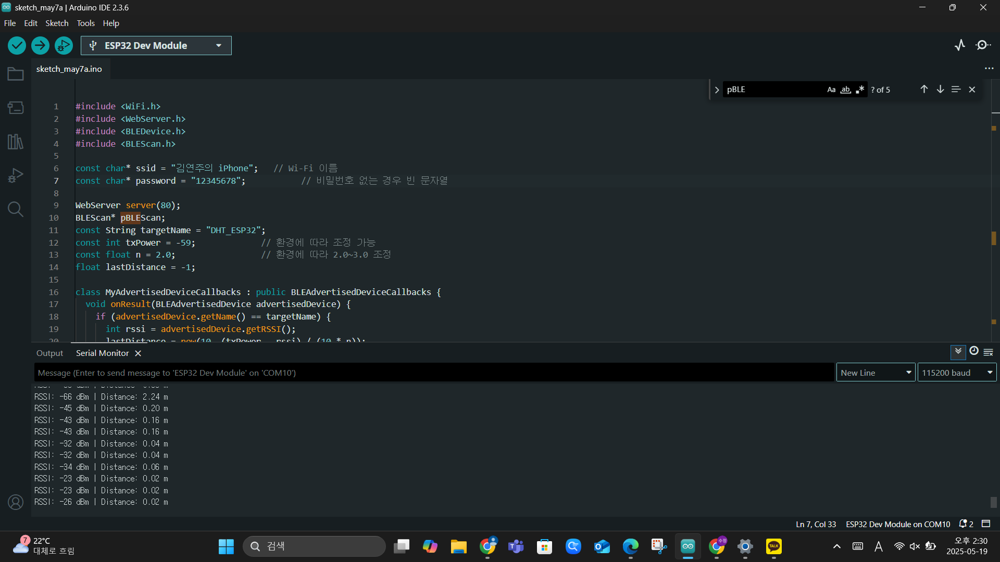
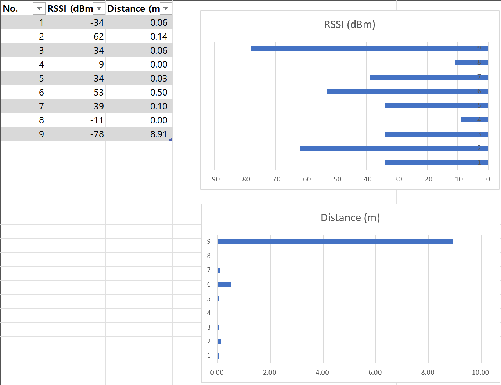

# IoT25-HW07
Assignment 7. BLE-based Distance Estimation System

---
## Project Overview

This project implements a **BLE-based distance estimation system** using two ESP32 devices.  
A **BLE Server** continuously advertises its presence, and a **BLE Client** scans for RSSI signals, calculates distance using a path-loss model, and presents the data in real time.

## Distance Estimation Model

The following formula was used to estimate distance based on RSSI values:

distance (m) = 10 ^ ((txPower - RSSI) / (10 * n))
txPower: Measured RSSI at 1m (default -59 dBm)
n: Path-loss exponent (typically 2.0)
RSSI: Received Signal Strength Indicator from BLE advertisement

## System Components
- BLE Server
Device name: "DHT_ESP32"
Continuously advertises for discovery
No characteristics – only used for broadcasting presence

- BLE Client
-> Base Version
Scans for "DHT_ESP32"

Reads RSSI and calculates distance

Prints distance to Serial Monitor

-> Advanced Versions (Extra Credit)
Due to sketch size limitations, the advanced features were implemented in two separate sketches:

| File                 | Features                                                 |
| -------------------- | -------------------------------------------------------- |
| `ble_client_led.ino` | Base + **LED blinks** if distance ≤ 1m                   |
| `ble_client_web.ino` | Base + **Web Server shows distance**                     |


## Result

### photo & videos of the experiment


LED blinks
(https://youtube.com/shorts/4TM877-_Y5A?feature=share)
(https://youtube.com/shorts/62eikbrYEug?feature=share)

Web Server shows distance
(https://youtu.be/rF1EMM_WAkM)

### Table and bar chart of results

use excel

use python matplotlib

---
## Source code

| File                 | Description                                |
| -------------------- | ------------------------------------------ |
| `ble_server.ino`     | BLE server that advertises `DHT_ESP32`     |
| `ble_client_led.ino` | BLE client with LED alert logic            |
| `ble_client_web.ino` | BLE client with web-based distance display |


```cpp
### ble_server.ino

// BLE Server (ESP32)
#include <BLEDevice.h>
#include <BLEUtils.h>
#include <BLEServer.h>

void setup() {
  Serial.begin(115200);
  BLEDevice::init("DHT_ESP32");  // 서버 이름 설정

  BLEServer *pServer = BLEDevice::createServer();
  BLEAdvertising *pAdvertising = BLEDevice::getAdvertising();
  
  pAdvertising->start();  // Advertising 시작
  Serial.println("BLE Server advertising started...");
}

void loop() {
  delay(1000);
}

### ble_client_led.ino
#include <BLEDevice.h>
#include <BLEUtils.h>
#include <BLEScan.h>

// BLE 설정
int scanTime = 5;
BLEScan* pBLEScan;
const String targetName = "DHT_ESP32";

// 거리 계산 파라미터
const int txPower = -59;
const float pathLossExponent = 2.0;
float lastDistance = -1.0;

// LED 핀 설정
const int ledPin = 21;  // GPIO21

// 거리 계산 함수
float calculateDistance(int rssi) {
  return pow(10.0, ((float)(txPower - rssi)) / (10.0 * pathLossExponent));
}

// BLE 스캔 콜백 클래스
class MyAdvertisedDeviceCallbacks : public BLEAdvertisedDeviceCallbacks {
  void onResult(BLEAdvertisedDevice advertisedDevice) {
    if (advertisedDevice.getName() == targetName.c_str()) {
      int rssi = advertisedDevice.getRSSI();
      lastDistance = calculateDistance(rssi);

      Serial.print("RSSI: ");
      Serial.print(rssi);
      Serial.print(" dBm | Distance: ");
      Serial.print(lastDistance, 2);
      Serial.println(" m");
    }
  }
};

void setup() {
  Serial.begin(115200);
  pinMode(ledPin, OUTPUT);
  digitalWrite(ledPin, LOW);

  BLEDevice::init("");
  pBLEScan = BLEDevice::getScan();
  pBLEScan->setAdvertisedDeviceCallbacks(new MyAdvertisedDeviceCallbacks());
  pBLEScan->setActiveScan(true);
}

void loop() {
  // BLE 스캔 수행
  pBLEScan->start(scanTime, false);  // 반환값 저장하지 않음
  pBLEScan->clearResults();

  // 거리 조건 확인 후 LED 깜빡이기
  if (lastDistance > 0 && lastDistance <= 1.0) {
    digitalWrite(ledPin, HIGH);
    delay(800);
    digitalWrite(ledPin, LOW);
    delay(800);
  } else {
    digitalWrite(ledPin, LOW);
    delay(500);
  }
}

### ble_client_web.ino
#include <WiFi.h>
#include <WebServer.h>
#include <BLEDevice.h>
#include <BLEScan.h>

const char* ssid = "김연주의 iPhone";   // Wi-Fi 이름
const char* password = "12345678";           // 비밀번호 없는 경우 빈 문자열

WebServer server(80);
BLEScan* pBLEScan;
const String targetName = "DHT_ESP32";
const int txPower = -59;             // 환경에 따라 조정 가능
const float n = 2.0;                 // 환경에 따라 2.0~3.0 조정
float lastDistance = -1;

class MyAdvertisedDeviceCallbacks : public BLEAdvertisedDeviceCallbacks {
  void onResult(BLEAdvertisedDevice advertisedDevice) {
    if (advertisedDevice.getName() == targetName) {
      int rssi = advertisedDevice.getRSSI();
      lastDistance = pow(10, (txPower - rssi) / (10 * n));
      Serial.printf("RSSI: %d dBm | Distance: %.2f m\n", rssi, lastDistance);
    }
  }
};

void handleRoot() {
  server.send(200, "text/plain", String(lastDistance, 2) + "m");
}

void setup() {
  Serial.begin(115200);

  BLEDevice::init("");
  pBLEScan = BLEDevice::getScan();
  pBLEScan->setAdvertisedDeviceCallbacks(new MyAdvertisedDeviceCallbacks());
  pBLEScan->setActiveScan(true);

  WiFi.begin(ssid, password);
  Serial.print("Connecting to WiFi");
  while (WiFi.status() != WL_CONNECTED) {
    delay(500);
    Serial.print(".");
  }
  Serial.println();
  Serial.print("Connected! IP: ");
  Serial.println(WiFi.localIP());  // 웹서버 주소 출력

  server.on("/", handleRoot);
  server.begin();
  Serial.println("Web server started.");
}

void loop() {
  pBLEScan->start(3, false);  // 3초간 BLE 스캔
  server.handleClient();
  delay(500);
}
